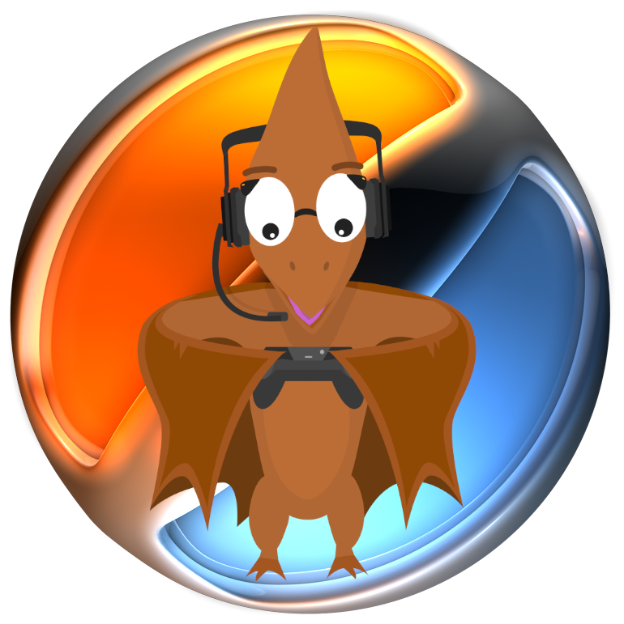

  <a href="https://github.com/gsh-lan/unwindia" target="blank">
  

### About
> Unwindia is the on demand game server creation service for [pterodactyl](https://pterodactyl.io/) (as game server management panel) combined with the lan party management system [DOTLAN Intranet](http://intranet.dotlan.net/news/) which [we / Gamesession Hannover](https://xxl.gsh-lan.com/news/) are using at our lan parties.

### How it works
> Every time a tourney match has been scheduled and both teams are ready to play, [Unwindia](https://github.com/GSH-LAN/Unwindia) will created a new game server or update a suspended game server at [pterodactyl](https://pterodactyl.io/) and update the tourney match information with the connection details for the game server.
>
> After the match has finished [Unwindia](https://github.com/GSH-LAN/Unwindia) will suspend the game server and sent it back into the pool if a new game server is needed

### Supported games
> [x] CSGO
>
> [ ] to be continued / extended

### Supported lan party & tournament cms
> [x] [DOTLAN Intranet](http://intranet.dotlan.net/news/)
>
> [ ] to be continued / extended

### how is it structured?

### Service repositories
| Name | Repo | Build status |
|:---:|:---:|:---:|
| Configuration | [Unwindia_config](https://github.com/GSH-LAN/Unwindia_config) | ... |