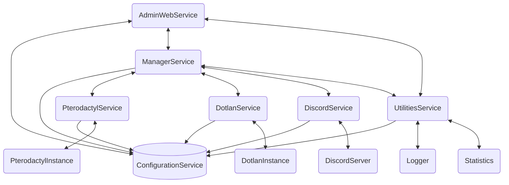

<!-- generated by mermaid compile action - START -->

```mermaid
flowchart TD;
    A[(ConfigurationService)];
    B(ManagerService);
    C(PterodactylService);
    CC(PterodactylInstance);
    D(DotlanService);
    DD(DotlanInstance);
    E(DiscordService);
    EE(DiscordServer);
    F(UtilitiesService);
    FF(Logger);
    FFF(Statistics);
    G(AdminWebService);
    B --> A;
    C --> A;
    D --> A;
    E --> A;
    F --> A;
    G <--> A;
    B <--> C;
    B <--> D;
    B <--> E;
    B <--> F;
    C <--> CC;
    D <--> DD;
    E <--> EE;
    F <--> FF;
    F <--> FFF;
    G <--> B;
    G <--> F;
```

<!-- generated by mermaid compile action - END -->
